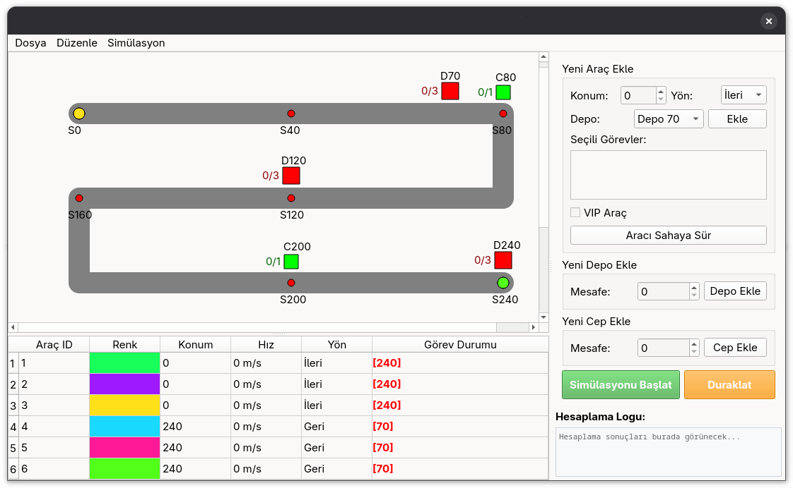

# önceliklendirilmiş işbirlikçi A* temelli çok etmenli yol bulma

*Cooperative A* Multi-Agent Pathfinding*



## bağımlılıklar

```bash
PyQt5
```

## çalıştırma

```bash
python main.py
```

ya da

```bash
chmod +x main.py
./main.py
```
